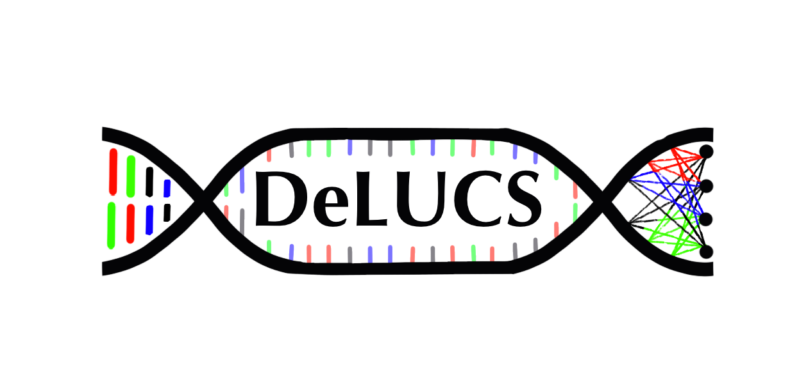

<p align="center">
  
</p>


An interactive deep-leraning based tool for clustering genomic sequences.

## Installation via CLI (Linux and macOS)

The installation via command-line interface requires [git](https://git-scm.com/) and [pip](https://pypi.org/project/pip/) installed. Follow the steps after making sure you have them installed on your machine.

0. (**Optional**) Create and activate a new virtual environment
```
$ mkdir iDeLUCS
$ cd iDeLUCS # go to project folder
$ python -m venv myEnv
```

1. Clone this repository
 ```
$ git clone https://github.com/millanp95/iDeLUCS.git .
  ```
2. Install required dependencies
```
$ cd iDeLUCS-master
$ pip install -r requirements.txt 	
```
**Note:** iDeLUCS uses PyTorch as the machine learning development framework. Its latest stable release might not be compatible with your version of CUDA.  

3. Test installation
```
$ python iDeLUCS.py -h 	
```

## Installation (Windows)
Pending ....


### Clustering parameters

iDeLUCS assigns a cluster identifier to all the DNA sequences present in a sigle FASTA file. The path to this file must be provided as input in both the CLI and the GUI versions of iDeLUCS. There are several hyperparameters that are required to perform the clustering. The user may use the default values or select a specific one depending on the amount of information that is available about the dataset. 

Argument Name| Variable Type | Description | Options
--- | --- | --- | --- 
<sequence_file>| string | Path for single Fasta file with training sequences | Required to run the program. 
--GT_file | string | Path for a tab-separated file with possible labels for the training dataset. These labels won't be used during training, just for posthoc analysis. The GT file must contain the columns: `sequence_id` with the sequence identifiers, these identifiers must correspond to the identifiers provided in the `<sequence_file>`. The column `cluster_id` with the "ground truth" assignments for each sequence. Additionally, the user may include an additional column with alternative labeling under the header `phylogeny` | Default = None.
--k| integer|k-mer length|  Default = 6, Options:`[4,5,6]`
--n_clusters| integer|Expected or maximum number of clusters to find. It should be at least `n_true_clusters` when `GT_file` is provided' | Default = 5 ; Range: 2-100
--n_epochs| integer | Number of training epochs. An epoch is defined as a training iteration over all the training pairs.' | Default: `50` ; Recommended Range: `[50,150]`
--n_mimics | integer | Number of data augmentations per sequence that will be considered during training | Default = 50; Recommended Range: 50-150
--batch_sz | integer | Number of data pairs the network will receive simultaneously during training. A larger batch may improve convergence but it may harm the accuracy. It must be a multiple of `n_mimcs`.| Default: 3; Recommended Range: 0-600. **Note**: This value might be limited by the capacity of your machine. 
--optimizer | string | Optimization algorithm to train the neural network | `['SGD', 'Adam','RMSprop']`
--lambda| float | Hyperparameter to control cluster balance. | Default = 2.8; Recommended Range  1 (highly imbalanced dataset) - 3 (perfectly balanced dataset)
--noise |integer | Addition of noise to the network parameters to prevent overfitting This parameter indicates the frequency of noise introduction during training.| Default = 1 (keep all non-syn. mutations) ; Recommended Range: 10 -20.  **Note**: Use noise: `0` for no noise during training

## Example datasets
We provide several datasets to test the perfomance of iDeLUCS to find meaningful genomic signatures for organisms in different kingdoms and at different taxonomic levels.

### Running example datasets
```
python iDeLUCS.py Example/FASTA.fas --GT_file=Example/GT.tsv --n_epochs=50 --lambda=2.8 --k=6 --n_clusters=5 --n_mimics=3 --batch_sz=360
```

Clustering an unkown datasatet with Protists
```
python iDeLUCS.py Example/FASTA_no_labels.fas --n_epochs=30 --lambda=1.2 --k=6 --n_clusters=3 --n_mimics=8 --batch_sz=360
```

### Clustering your own sequences
GUI: 
```
python DeLUCS_GUI.py
```

For command line application: 
```
python iDeLUCS.py <sequence_file>
```
